# Diagrams

Markdown supports creating various types of diagrams and flowcharts using Mermaid syntax, providing visual expression for your documentation.

## Introduction to Mermaid

Mermaid is a text-based diagram generation tool that supports multiple diagram types:

- Flowchart
- Sequence Diagram
- Gantt Chart
- Class Diagram
- State Diagram
- Pie Chart
- User Journey
- Git Graph

## Basic Syntax

### Flowchart

```markdown
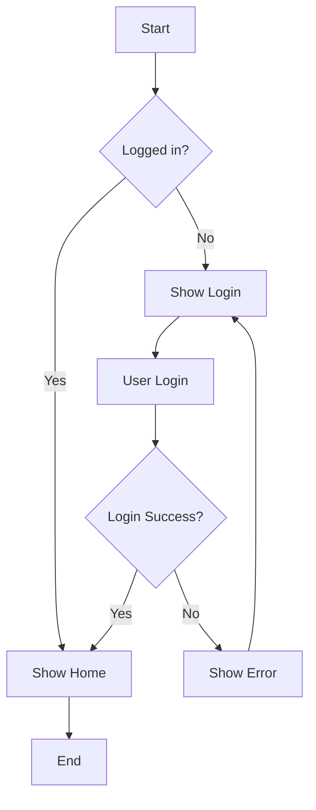
```

**Rendered Output:**


### Sequence Diagram

```markdown
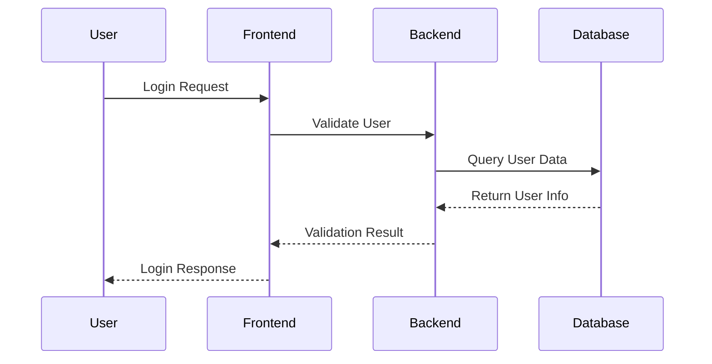
```

**Rendered Output:**


## Flowchart Details

### Node Types

```markdown
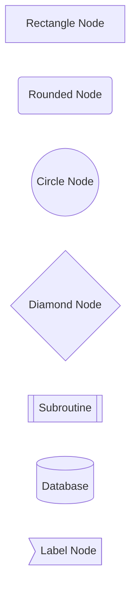
```

**Rendered Output:**


### Edge Types

```markdown
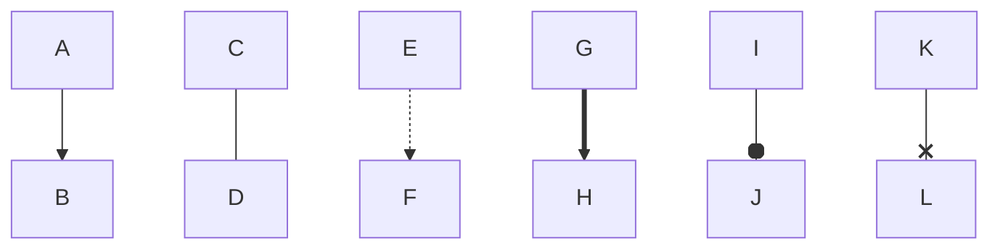
```

**Rendered Output:**


### Direction Control

```markdown
<!-- Top to Bottom -->
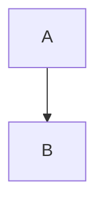

<!-- Bottom to Top -->
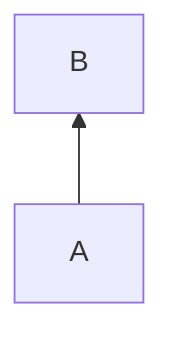

<!-- Left to Right -->
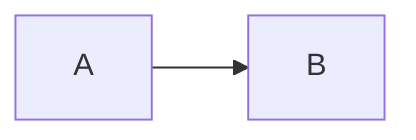

<!-- Right to Left -->
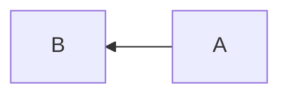
```

### Complex Flowchart Example

```markdown
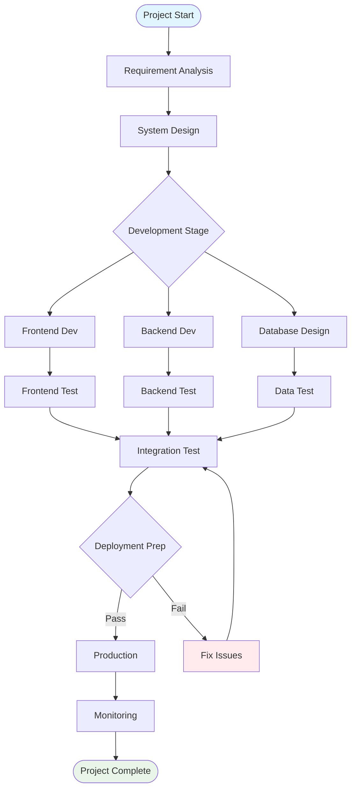
```

**Rendered Output:**


## Sequence Diagram Details

### Basic Syntax

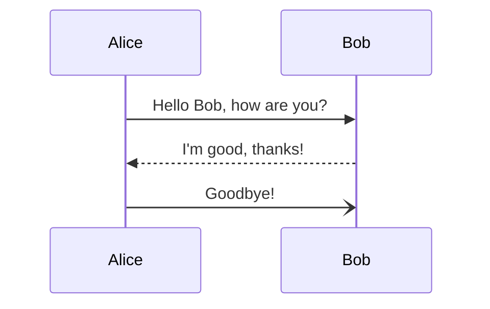

**Rendered Output:**


### Activation Bars and Lifelines

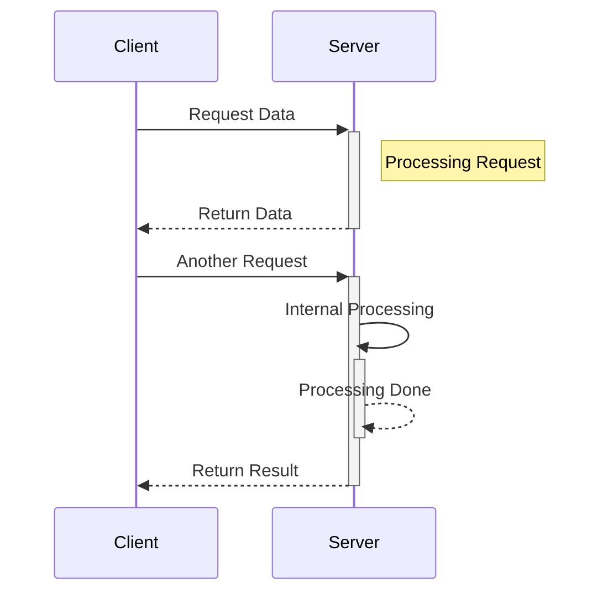

**Rendered Output:**


### Loops and Conditions

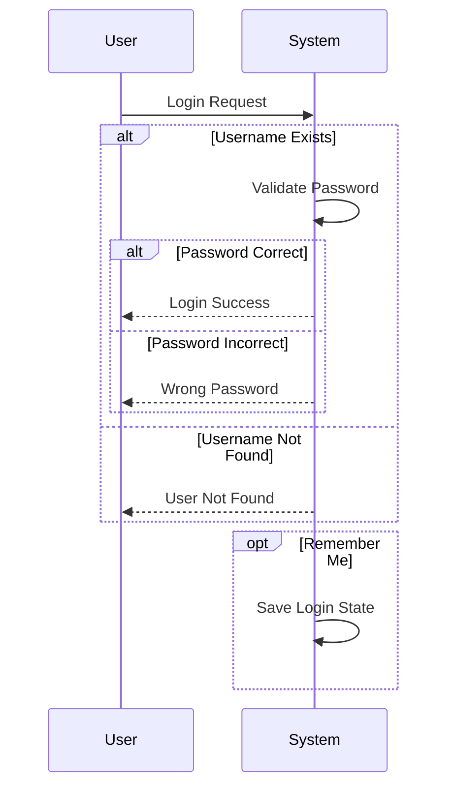

**Rendered Output:**


## Class Diagram

```mermaid
classDiagram
    class Animal {
        +String name
        +int age
        +eat()
        +sleep()
    }
    
    class Dog {
        +String breed
        +bark()
        +wagTail()
    }
    
    class Cat {
        +String color
        +meow()
        +purr()
    }
    
    Animal <|-- Dog
    Animal <|-- Cat
    
    class Owner {
        +String name
        +feedPet()
    }
    
    Owner --> Animal : owns
```

**Rendered Output:**

```mermaid
classDiagram
    class Animal {
        +String name
        +int age
        +eat()
        +sleep()
    }
    
    class Dog {
        +String breed
        +bark()
        +wagTail()
    }
    
    class Cat {
        +String color
        +meow()
        +purr()
    }
    
    Animal <|-- Dog
    Animal <|-- Cat
    
    class Owner {
        +String name
        +feedPet()
    }
    
    Owner --> Animal : owns
```

## State Diagram

```mermaid
stateDiagram-v2
    [*] --> Idle
    Idle --> Running : Start
    Running --> Paused : Pause
    Running --> Finished : End
    Paused --> Running : Resume
    Paused --> Stopped : Stop
    Stopped --> Idle : Reset
    Finished --> Idle : Reset
    Finished --> [*]
    
    state Running {
        [*] --> Init
        Init --> Processing
        Processing --> Validate
        Validate --> [*]
    }
```

**Rendered Output:**

```mermaid
stateDiagram-v2
    [*] --> Idle
    Idle --> Running : Start
    Running --> Paused : Pause
    Running --> Finished : End
    Paused --> Running : Resume
    Paused --> Stopped : Stop
    Stopped --> Idle : Reset
    Finished --> Idle : Reset
    Finished --> [*]
    
    state Running {
        [*] --> Init
        Init --> Processing
        Processing --> Validate
        Validate --> [*]
    }
```

## Gantt Chart

```mermaid
gantt
    title Project Development Timeline
    dateFormat  YYYY-MM-DD
    section Requirement Analysis
    Requirement Collection          :done,    des1, 2024-01-01,2024-01-05
    Requirement Analysis            :done,    des2, after des1, 5d
    Requirement Review              :done,    des3, after des2, 2d
    
    section Design Phase
    System Design                   :active,  design1, 2024-01-12, 7d
    UI Design                       :         design2, after design1, 5d
    Database Design                 :         design3, after design1, 3d
    
    section Development Phase
    Frontend Development            :         dev1, after design2, 10d
    Backend Development             :         dev2, after design3, 12d
    Testing                         :         test1, after dev1, 5d
```

## Pie Chart

```mermaid
pie title Website Traffic Sources
    "Search Engine" : 45
    "Social Media" : 25
    "Direct" : 20
    "Email Marketing" : 7
    "Other" : 3
```

## User Journey

```mermaid
journey
    title User Shopping Journey
    section Discovery
      Visit Homepage: 3: User
      Browse Products: 4: User
      Search Products: 4: User
    section Consideration
      View Details: 4: User
      Compare Prices: 3: User
      Read Reviews: 5: User
    section Purchase
      Add to Cart: 4: User
      Checkout: 3: User
      Pay: 2: User
    section Use
      Receive Product: 5: User
      Use Product: 4: User
      Write Review: 4: User
```

## Git Graph

```mermaid
gitgraph
    commit id: "Initial Commit"
    commit id: "Add User Module"
    branch feature/auth
    commit id: "Add Login Feature"
    commit id: "Add Register Feature"
    checkout main
    commit id: "Fix Home Bug"
    merge feature/auth
    commit id: "v1.0 Release"
    branch hotfix
    commit id: "Urgent Fix"
    checkout main
    merge hotfix
    commit id: "v1.0.1 Release"
```

## Real-World Scenarios

### System Architecture Diagram

```mermaid
flowchart TB
    subgraph "User Layer"
        Web[Web Browser]
        Mobile[Mobile App]
        API[API Client]
    end
    
    subgraph "Gateway Layer"
        Gateway[API Gateway]
        Auth[Auth Service]
    end
    
    subgraph "Service Layer"
        UserService[User Service]
        OrderService[Order Service]
        PaymentService[Payment Service]
        NotificationService[Notification Service]
    end
    
    subgraph "Data Layer"
        UserDB[(User DB)]
        OrderDB[(Order DB)]
        Cache[(Redis Cache)]
        Queue[Message Queue]
    end
    
    Web --> Gateway
    Mobile --> Gateway
    API --> Gateway
    
    Gateway --> Auth
    Gateway --> UserService
    Gateway --> OrderService
    Gateway --> PaymentService
    
    UserService --> UserDB
    OrderService --> OrderDB
    PaymentService --> Queue
    NotificationService --> Queue
    
    UserService --> Cache
    OrderService --> Cache
    
    style Gateway fill:#e1f5fe
    style Auth fill:#fff3e0
    style Cache fill:#f3e5f5
```

### API Call Flow

```mermaid
sequenceDiagram
    participant C as Client
    participant G as API Gateway
    participant A as Auth Service
    participant U as User Service
    participant D as Database
    participant R as Redis
    
    C->>G: Request User Info
    G->>A: Validate Token
    A->>R: Check Token Cache
    R-->>A: Token Valid
    A-->>G: Auth Success
    
    G->>U: Get User Info
    U->>R: Check User Cache
    alt Cache Exists
        R-->>U: Return User Data
    else Cache Miss
        U->>D: Query Database
        D-->>U: Return User Info
        U->>R: Update Cache
    end
    
    U-->>G: Return User Info
    G-->>C: Respond User Data
```

### Business Flowchart

```mermaid
flowchart TD
    Start([User Order]) --> Check{Check Stock}
    Check -->|In Stock| Reserve[Reserve Stock]
    Check -->|Out of Stock| OutOfStock[Out of Stock]
    OutOfStock --> Notify[Notify User]
    Notify --> End1([End])
    
    Reserve --> Payment{Payment Processing}
    Payment -->|Success| ConfirmOrder[Confirm Order]
    Payment -->|Fail| ReleaseStock[Release Stock]
    ReleaseStock --> PaymentFailed[Payment Failed]
    PaymentFailed --> End2([End])
    
    ConfirmOrder --> UpdateInventory[Update Inventory]
    UpdateInventory --> SendNotification[Send Notification]
    SendNotification --> Logistics[Arrange Logistics]
    Logistics --> End3([Order Complete])
    
    style Start fill:#e8f5e8
    style End1 fill:#ffebee
    style End2 fill:#ffebee
    style End3 fill:#e8f5e8
    style OutOfStock fill:#ffebee
    style PaymentFailed fill:#ffebee
```

## Styles and Themes

### Node Styles

```mermaid
flowchart LR
    A[Default Style] --> B[Style 1]
    A --> C[Style 2]
    A --> D[Style 3]
    
    style B fill:#f9f,stroke:#333,stroke-width:4px
    style C fill:#bbf,stroke:#f66,stroke-width:2px,color:#fff,stroke-dasharray: 5 5
    style D fill:#f96,stroke:#333,stroke-width:4px,color:#fff
```

### Class Styles

```mermaid
flowchart LR
    A[Node A]:::classA --> B[Node B]:::classB
    A --> C[Node C]:::classC
    
    classDef classA fill:#e1f5fe,stroke:#01579b,stroke-width:2px
    classDef classB fill:#f3e5f5,stroke:#4a148c,stroke-width:2px
    classDef classC fill:#e8f5e8,stroke:#1b5e20,stroke-width:2px
```

## Configuration and Compatibility

### VitePress Configuration

```javascript
// .vitepress/config.js
export default {
  markdown: {
    mermaid: true
  }
}
```

### GitHub Support

GitHub natively supports Mermaid, you can use it directly in Markdown files:

```markdown
```mermaid
graph LR
    A --> B
```
```

### Other Platform Support

| Platform      | Support      | Config Requirement |
|--------------|--------------|-------------------|
| **GitHub**   | ✅ Native     | None              |
| **GitLab**   | ✅ Native     | None              |
| **VitePress**| ✅ Plugin     | Needs config      |
| **Jekyll**   | ✅ Plugin     | Install plugin    |
| **Hugo**     | ✅ Theme      | Depends on theme  |

## Best Practices

### Design Tips

```markdown
✅ Recommended:

1. **Keep it simple:**
   - Avoid overly complex diagrams
   - Use clear labels and connections

2. **Logical layout:**
   - Choose appropriate diagram direction
   - Keep logical flow clear

3. **Consistent style:**
   - Use a consistent color theme
   - Keep diagram style unified

4. **Add explanations:**
   - Add titles for complex diagrams
   - Provide necessary text explanations

❌ Avoid:

1. Diagrams too complex to understand
2. Too many crossing lines
3. Vague labels
4. Missing legends
```

### Performance Considerations

```markdown
- **Large diagram optimization:**
  - Consider splitting complex diagrams
  - Use subgraphs for organization

- **Load performance:**
  - Avoid too many diagrams on a single page
  - Consider lazy loading

- **Mobile adaptation:**
  - Ensure diagrams are readable on small screens
  - Consider horizontal scrolling
```

## Related Syntax

- [Embed HTML](/advanced/html) - HTML enhancements
- [Math Formulas](/advanced/math) - LaTeX expressions
- [Best Practices](/advanced/best-practices) - Writing tips

## Tools and Resources

### Online Editors

- **Mermaid Live Editor**: Official online editor
- **Draw.io**: General diagram tool
- **Lucidchart**: Professional diagram platform
- **Excalidraw**: Hand-drawn style diagrams

### Developer Tools

- **Mermaid CLI**: Command line tool
- **VS Code Mermaid**: Visual Studio Code extension
- **Atom Mermaid**: Atom editor extension
- **IntelliJ Mermaid**: JetBrains IDE extension

### References

- **Mermaid Official Docs**: Full syntax reference
- **Mermaid Example Library**: Various diagram examples
- **GitHub Mermaid**: Usage on GitHub
- **Awesome Mermaid**: Resource collection

By mastering flowchart syntax, you can create professional visual diagrams in your documentation, enhancing clarity and expressiveness. 