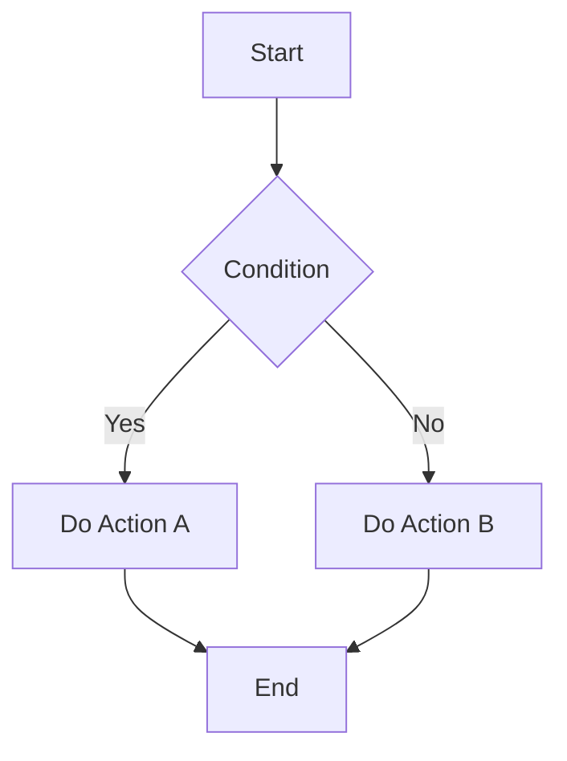
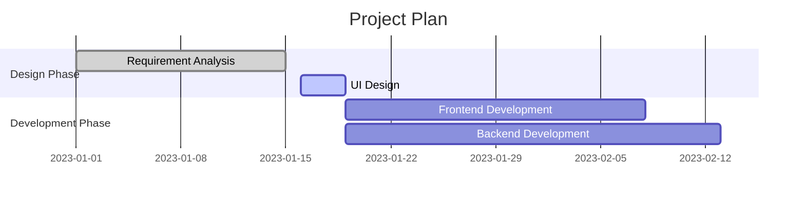

# Advanced Markdown Usage

When the basic and extended syntax of Markdown cannot meet specific needs, you need to master some advanced tips and workarounds. This chapter introduces how to break through Markdown's limitations to achieve more complex formatting and functionality.

## What is Advanced Usage?

Advanced usage (also known as workarounds) refers to achieving specific formatting effects through creative methods under Markdown syntax limitations. These tips usually involve:

- Embedding HTML code
- Combining different syntax elements
- Using platform-specific extensions
- Using third-party tools and plugins

## Main Application Scenarios

### Layout Control
- Text alignment
- Multi-column layout
- Mixed text and images
- Spacing adjustment

### Style Customization
- Color settings
- Font modification
- Size control
- Special effects

### Advanced Content
- Mathematical formulas
- Flowcharts and diagrams
- Interactive elements
- Embedded media

## HTML Enhancements

### Basic HTML Tags

Markdown supports using HTML tags directly in documents:

```html
<div style="text-align: center;">
  <strong style="color: red;">Centered bold red text</strong>
</div>


<table border="1">
  <tr>
    <td style="background-color: #f0f0f0;">Table with custom style</td>
  </tr>
</table>
```

### Style Control

Use CSS styles for precise control:

```html
<p style="color: blue; font-size: 18px; text-align: center;">
  Blue, 18px, centered paragraph
</p>

<div style="border: 2px solid #333; padding: 10px; border-radius: 5px;">
  Content area with border
</div>
```

## Advanced Image Handling

### Image Alignment

```html
<!-- Left aligned -->


<!-- Right aligned -->


<!-- Center aligned -->
<div align="center">
  
</div>
```

### Image Size Control

```html
<!-- Fixed width and height -->


<!-- Responsive image -->


<!-- Image with border -->

```

### Mixed Text and Images

```html
<div style="display: flex; align-items: center;">
  
  <div>
    <h3 style="margin: 0;">Username</h3>
    <p style="margin: 5px 0;">This is the user's introduction text...</p>
  </div>
</div>
```

## Table Enhancements

### Table Style Customization

```html
<table style="border-collapse: collapse; width: 100%;">
  <thead style="background-color: #f2f2f2;">
    <tr>
      <th style="border: 1px solid #ddd; padding: 8px;">Column Title 1</th>
      <th style="border: 1px solid #ddd; padding: 8px;">Column Title 2</th>
    </tr>
  </thead>
  <tbody>
    <tr style="background-color: #f9f9f9;">
      <td style="border: 1px solid #ddd; padding: 8px;">Data 1</td>
      <td style="border: 1px solid #ddd; padding: 8px;">Data 2</td>
    </tr>
  </tbody>
</table>
```

### Complex Table Structures

```html
<table>
  <tr>
    <td rowspan="2">Merged Row</td>
    <td>Normal Cell</td>
  </tr>
  <tr>
    <td>Normal Cell</td>
  </tr>
  <tr>
    <td colspan="2">Merged Column</td>
  </tr>
</table>
```

## Math Formula Support

### LaTeX Syntax

Many platforms support LaTeX math formulas:

```latex
Inline formula: $E = mc^2$

Block formula:
$$
\int_{-\infty}^{\infty} e^{-x^2} dx = \sqrt{\pi}
$$

Matrix:
$$
\begin{pmatrix}
a & b \\
c & d
\end{pmatrix}
$$
```

### MathJax Integration

```html
<script src="https://polyfill.io/v3/polyfill.min.js?features=es6"></script>
<script id="MathJax-script" async src="https://cdn.jsdelivr.net/npm/mathjax@3/es5/tex-mml-chtml.js"></script>
```

## Flowcharts and Diagrams

### Mermaid Diagrams



### Gantt Chart



## Interactive Elements

### Collapsible Content

```html
<details>
  <summary>Click to expand</summary>
  <p>This is the collapsed content...</p>
</details>
```

### Progress Bar

```html
<progress value="70" max="100">70%</progress>
```

### Button Style

```html
<button style="background-color: #4CAF50; color: white; padding: 10px 20px; border: none; border-radius: 4px;">
  Click Button
</button>
```

## Layout Tips

### Multi-column Layout

```html
<div style="display: grid; grid-template-columns: 1fr 1fr; gap: 20px;">
  <div>
    <h3>Left Column Content</h3>
    <p>This is the content of the left column...</p>
  </div>
  <div>
    <h3>Right Column Content</h3>
    <p>This is the content of the right column...</p>
  </div>
</div>
```

### Card Layout

```html
<div style="border: 1px solid #ddd; border-radius: 8px; padding: 16px; margin: 16px 0; box-shadow: 0 2px 4px rgba(0,0,0,0.1);">
  <h3 style="margin-top: 0;">Card Title</h3>
  <p>Card content description...</p>
  <a href="#" style="color: #007bff; text-decoration: none;">Learn More</a>
</div>
```

## Platform-specific Features

### GitHub Features

```markdown
<!-- Task List -->
- [x] Completed task
- [ ] Incomplete task

<!-- Mention user -->
@username

<!-- Reference issue -->
#123

<!-- Code diff -->
```diff
- Deleted line
+ Added line
```
```

### GitLab Features

```markdown
<!-- Video embed -->


<!-- Audio embed -->

```

## Best Practice Recommendations

### Compatibility Considerations
- Test your advanced syntax on different platforms
- Provide fallback solutions for unsupported platforms
- Prefer standard Markdown syntax

### Performance Optimization
- Avoid excessive use of inline styles
- Use external CSS files for unified styling
- Compress images and media files

### Maintainability
- Keep code clean and readable
- Add necessary comments
- Use version control to manage documentation

## Tools and Resources

### Recommended Editors
- [Typora](https://typora.io/) - WYSIWYG editor
- [Obsidian](https://obsidian.md/) - Knowledge management tool
- [Mark Text](https://marktext.app/) - Real-time preview editor

### Online Tools
- [Markdown Tables Generator](https://www.tablesgenerator.com/markdown_tables)
- [Mermaid Live Editor](https://mermaid.live/)
- [LaTeX Formula Editor](https://www.latexlive.com/)

### Reference Resources
- [CommonMark Spec](https://commonmark.org/)
- [GitHub Flavored Markdown](https://github.github.com/gfm/)
- [Markdown Guide](https://www.markdownguide.org/)

## Further Learning

- [HTML Embedding Explained](/advanced/html)
- [Math Formula Syntax](/advanced/math)
- [Flowchart Creation](/advanced/diagrams)
- [Best Practices Guide](/advanced/best-practices) 