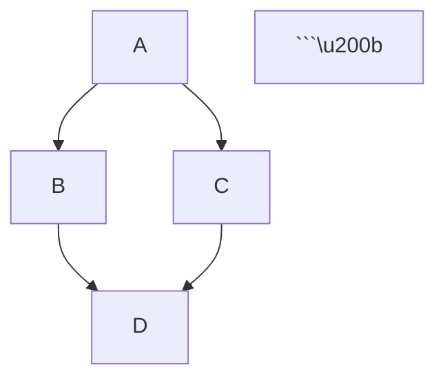

# Markdown Plugins and Extensions

Markdown plugins and extensions allow you to add features beyond the basic syntax, enabling tables, footnotes, task lists, and much more.

## Popular Markdown Processors

### Markdown-it

A fast and extensible Markdown parser with a plugin ecosystem.

```javascript
const md = require('markdown-it')();

// Enable plugins
md.use(require('markdown-it-footnote'))
  .use(require('markdown-it-abbr'))
  .use(require('markdown-it-emoji'));

const result = md.render('# Hello :smile:');
```

### Remark

Markdown processor powered by plugins, part of the unified collective.

```javascript
const remark = require('remark');
const html = require('remark-html');
const gfm = require('remark-gfm');

remark()
  .use(gfm)
  .use(html)
  .process('## Hello **world**!', (err, file) => {
    console.log(String(file));
  });
```

### Marked

A low-level Markdown compiler for speed and flexibility.

```javascript
const marked = require('marked');

// Configure marked
marked.setOptions({
  breaks: true,
  gfm: true,
  highlight: function(code, lang) {
    return hljs.highlight(code, { language: lang }).value;
  }
});

const html = marked.parse('# Heading');
```

## Essential Plugins

### Tables

Add table support to Markdown:

```markdown
| Feature | Support |
|---------|---------|
| Tables  | ✅      |
| Syntax  | Easy    |
```

Plugin: `markdown-it-table`, `remark-gfm`

### Footnotes

Add footnotes to your documents:

```markdown
Here's a statement[^1] that needs a reference.

[^1]: This is the footnote content.
```

Plugin: `markdown-it-footnote`, `remark-footnotes`

### Task Lists

Interactive checkboxes:

```markdown
- [x] Completed task
- [ ] Incomplete task
- [ ] Another task
```

Plugin: `markdown-it-task-lists`, `remark-gfm`

### Emoji

Add emoji support:

```markdown
I :heart: Markdown! :rocket:
```

Plugin: `markdown-it-emoji`, `remark-emoji`

### Syntax Highlighting

Highlight code blocks:

```markdown
```javascript
function hello() {
  console.log("Hello!");
}
```\u200b
```

Plugin: `highlight.js`, `prism.js`

## Advanced Plugins

### Mathematical Equations

Render LaTeX/KaTeX equations:

```markdown
Inline math: $E=mc^2$

Block math:
$$
\int_0^\infty e^{-x^2} dx = \frac{\sqrt{\pi}}{2}
$$
```

Plugins:
- `markdown-it-katex`
- `remark-math` + `rehype-katex`
- `markdown-it-texmath`

### Diagrams

Create diagrams with Mermaid:

```markdown


Plugin: `mermaid`, `markdown-it-mermaid`

### Table of Contents

Auto-generate table of contents:

```markdown
[[toc]]

# Section 1
## Subsection 1.1

# Section 2
```

Plugin: `markdown-it-toc`, `remark-toc`

### Definition Lists

Add definition list support:

```markdown
Term 1
: Definition 1

Term 2
: Definition 2a
: Definition 2b
```

Plugin: `markdown-it-deflist`

### Containers/Admonitions

Custom block containers:

```markdown
::: warning
This is a warning message
:::

::: tip
This is a helpful tip
:::
```

Plugin: `markdown-it-container`, `remark-custom-blocks`

## Code Enhancement Plugins

### Line Numbers

Add line numbers to code blocks:

```javascript
const md = require('markdown-it')({
  highlight: function(str, lang) {
    // Add line numbers
    return '<pre class="line-numbers"><code>' +
           md.utils.escapeHtml(str) +
           '</code></pre>';
  }
});
```

### Code Titles

Add titles to code blocks:

```markdown
```js:example.js
console.log("Hello");
```\u200b
```

### Copy Button

Add copy-to-clipboard functionality:

```javascript
document.querySelectorAll('pre code').forEach((block) => {
  const button = document.createElement('button');
  button.innerText = 'Copy';
  button.onclick = () => {
    navigator.clipboard.writeText(block.innerText);
  };
  block.parentNode.appendChild(button);
});
```

## SEO and Metadata Plugins

### Meta Tags

Automatically generate meta tags:

```javascript
const meta = require('remark-meta');

remark()
  .use(meta)
  .process(markdown, (err, file) => {
    console.log(file.data.meta);
  });
```

### Open Graph

Generate Open Graph tags:

```markdown
---
og:title: My Article
og:description: Article description
og:image: /image.jpg
---
```

### Reading Time

Calculate reading time:

```javascript
const readingTime = require('reading-time');

const stats = readingTime(markdownContent);
console.log(stats.text); // "5 min read"
```

## Transformation Plugins

### Auto-linking

Convert URLs to links automatically:

```markdown
Visit https://example.com for more info.

Becomes:
Visit [https://example.com](https://example.com) for more info.
```

Plugin: `markdown-it-linkify`, `remark-autolink-headings`

### Image Optimization

Optimize and lazy-load images:

```javascript
const imagePlugin = require('remark-images');

remark()
  .use(imagePlugin, {
    maxWidth: 1200,
    quality: 80,
    withWebp: true,
    lazy: true
  })
  .process(markdown);
```

### Abbreviations

Add abbreviation support:

```markdown
The HTML specification is maintained by the W3C.

*[HTML]: Hyper Text Markup Language
*[W3C]: World Wide Web Consortium
```

Plugin: `markdown-it-abbr`

## Integration Plugins

### React/MDX

Use React components in Markdown:

```mdx
import { Chart } from './Chart'

# My Document

<Chart data={myData} />
```

### Vue

Use Vue components:

```markdown
<template>
  <MyComponent :data="data" />
</template>
```

### Svelte

Integrate with Svelte:

```markdown
<script>
  import Component from './Component.svelte';
</script>

<Component />
```

## Creating Custom Plugins

### Markdown-it Plugin

```javascript
function myPlugin(md, options) {
  // Save original rule
  const defaultRender = md.renderer.rules.link_open ||
    function(tokens, idx, options, env, self) {
      return self.renderToken(tokens, idx, options);
    };

  md.renderer.rules.link_open = function(tokens, idx, options, env, self) {
    // Add target="_blank" to external links
    const hrefIndex = tokens[idx].attrIndex('href');
    if (hrefIndex >= 0) {
      const href = tokens[idx].attrs[hrefIndex][1];
      if (href.startsWith('http')) {
        tokens[idx].attrPush(['target', '_blank']);
        tokens[idx].attrPush(['rel', 'noopener noreferrer']);
      }
    }

    return defaultRender(tokens, idx, options, env, self);
  };
}

module.exports = myPlugin;
```

### Remark Plugin

```javascript
const visit = require('unist-util-visit');

function remarkPlugin() {
  return (tree) => {
    visit(tree, 'link', (node) => {
      // Modify link nodes
      if (node.url.startsWith('http')) {
        node.data = node.data || {};
        node.data.hProperties = node.data.hProperties || {};
        node.data.hProperties.target = '_blank';
        node.data.hProperties.rel = 'noopener noreferrer';
      }
    });
  };
}

module.exports = remarkPlugin;
```

## Plugin Configuration

### Basic Configuration

```javascript
const md = require('markdown-it')({
  html: true,         // Enable HTML tags
  linkify: true,      // Auto-convert URLs
  typographer: true,  // Smart quotes
  breaks: false       // Convert \n to <br>
});
```

### Plugin Options

```javascript
md.use(require('markdown-it-container'), 'warning', {
  validate: function(params) {
    return params.trim().match(/^warning\s+(.*)$/);
  },
  render: function(tokens, idx) {
    if (tokens[idx].nesting === 1) {
      return '<div class="warning">\n';
    } else {
      return '</div>\n';
    }
  }
});
```

## Best Practices

1. **Choose Wisely**: Only use plugins you actually need
2. **Check Performance**: Profile plugin impact on build time
3. **Update Regularly**: Keep plugins up to date
4. **Test Thoroughly**: Test with various Markdown inputs
5. **Document Usage**: Document enabled plugins and their configuration
6. **Version Lock**: Use exact versions in production
7. **Security**: Vet plugins for security issues

## Popular Plugin Ecosystems

### Markdown-it Plugins

- **markdown-it-footnote**: Footnote support
- **markdown-it-abbr**: Abbreviation definitions
- **markdown-it-emoji**: Emoji shortcuts
- **markdown-it-sub/sup**: Subscript and superscript
- **markdown-it-mark**: Highlighted text
- **markdown-it-ins**: Inserted text
- **markdown-it-container**: Custom containers

### Remark Plugins

- **remark-gfm**: GitHub Flavored Markdown
- **remark-toc**: Table of contents
- **remark-math**: Math equation support
- **remark-html**: Convert to HTML
- **remark-rehype**: Convert to HTML AST
- **remark-frontmatter**: Parse frontmatter

### Unified Ecosystem

```javascript
const unified = require('unified');
const markdown = require('remark-parse');
const remark2rehype = require('remark-rehype');
const html = require('rehype-stringify');
const highlight = require('rehype-highlight');

unified()
  .use(markdown)
  .use(remark2rehype)
  .use(highlight)
  .use(html)
  .process(markdownContent);
```

## Troubleshooting

### Plugin Conflicts

```javascript
// Check plugin order
md.use(plugin1)  // Order matters!
  .use(plugin2);

// Some plugins may conflict
// Check documentation for compatibility
```

### Performance Issues

```javascript
// Profile plugins
console.time('markdown-render');
const result = md.render(content);
console.timeEnd('markdown-render');
```

### Debugging

```javascript
// Enable debug mode
const md = require('markdown-it')({
  debug: true
});

// Log tokens
const tokens = md.parse(content);
console.log(JSON.stringify(tokens, null, 2));
```

## Conclusion

Plugins and extensions make Markdown incredibly versatile. Choose the right combination of plugins to create a perfect writing and publishing workflow for your needs.

## Additional Resources

- [Markdown-it Plugins](https://www.npmjs.com/search?q=keywords:markdown-it-plugin)
- [Remark Plugins](https://github.com/remarkjs/remark/blob/main/doc/plugins.md)
- [Unified Plugins](https://github.com/unifiedjs/unified#plugin)
- [Awesome Markdown](https://github.com/mundimark/awesome-markdown)

