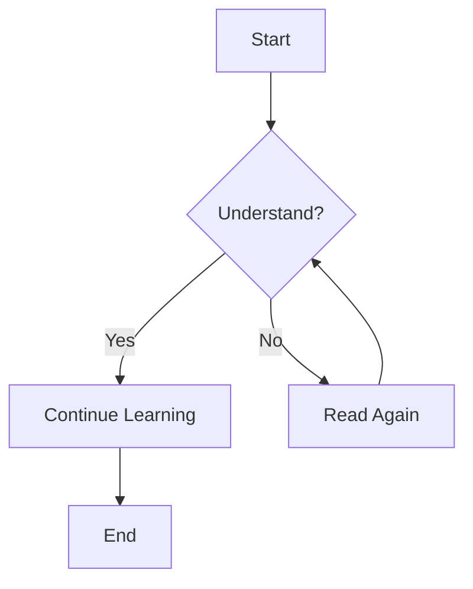

# Markdown Extended Syntax

Basic Markdown syntax provides the essential elements for creating documents, but sometimes that's not enough for specific needs. That's where extended syntax comes in.

Extended syntax adds extra features on top of the basics, allowing you to create richer and more complex documents.

## What is Extended Syntax?

Extended syntax refers to syntax elements beyond the original Markdown specification. These extensions are added by different Markdown processors to support additional features.

### Common Extended Syntax

- **Tables** – Create data tables
- **Fenced code blocks** – Code blocks with syntax highlighting
- **Footnotes** – Add footnote references
- **Heading IDs** – Add custom IDs to headings
- **Definition lists** – Lists of terms and definitions
- **Strikethrough** – Cross out text
- **Task lists** – Checklists with checkboxes
- **Emoji** – Emoji symbols
- **Highlight** – Highlight text
- **Subscript and superscript** – Common in math formulas

## Support

Note that **not all Markdown applications support extended syntax**. Before using, check if your Markdown processor supports the extensions you want.

### Mainstream Support

The following platforms and tools support extended syntax well:

- **GitHub Flavored Markdown (GFM)** – GitHub's Markdown extension
- **GitLab Flavored Markdown** – GitLab's extension
- **Typora** – Rich text Markdown editor
- **Obsidian** – Knowledge management tool
- **VitePress** – Static site generator
- **Hugo** – Static site generator

## Tables

Creating tables is one of the most common extensions:

```markdown
| Name  | Age | Occupation |
|-------|-----|-----------|
| Zhang | 25  | Engineer  |
| Li    | 30  | Designer  |
```

| Name  | Age | Occupation |
|-------|-----|-----------|
| Zhang | 25  | Engineer  |
| Li    | 30  | Designer  |

## Fenced Code Blocks

Code blocks with syntax highlighting:

````markdown
```javascript
function hello() {
    console.log("Hello, World!");
}
```
````

```javascript
function hello() {
    console.log("Hello, World!");
}
```

## Task Lists

Create to-do lists:

```markdown
- [x] Complete project plan
- [ ] Write code
- [ ] Test features
- [ ] Deploy online
```

- [x] Complete project plan
- [ ] Write code
- [ ] Test features
- [ ] Deploy online

## Strikethrough

Indicate deleted or incorrect content:

```markdown
~~This text has strikethrough~~
```

~~This text has strikethrough~~

## Autolinks

Automatically recognize URLs and email addresses:

```markdown
Visit https://markdown.com.cn for more information.
Contact: example@domain.com
```

Visit https://markdown.com.cn for more information.
Contact: example@domain.com

## Footnotes

Add notes and references to your document:

```markdown
Here is an example of a footnote[^1].

[^1]: This is the content of the footnote.
```

Here is an example of a footnote[^1].

[^1]: This is the content of the footnote.

## Definition Lists

Create lists of terms and definitions:

```markdown
Markdown
:   A lightweight markup language

HTML
:   HyperText Markup Language
:   The standard markup language for creating web pages
```

## Math Formulas

Support for LaTeX-style math formulas:

```markdown
Inline formula: $E = mc^2$

Block formula:
$$
\sum_{i=1}^n a_i = 0
$$
```

## Charts and Diagrams

Some advanced editors support Mermaid diagrams:

````markdown

````

## Learning Path for Extended Syntax

It is recommended to learn extended syntax in the following order:

1. **[Tables](/extended/tables)** – Most common and practical
2. **[Fenced Code Blocks](/extended/fenced-code-blocks)** – Essential for programmers
3. **[Task Lists](/extended/task-lists)** – Great for project management
4. **[Strikethrough](/extended/strikethrough)** – Simple and easy to use
5. **[Footnotes](/extended/footnotes)** – Needed for academic writing
6. **[Definition Lists](/extended/definition-lists)** – For term explanations
7. **[Heading IDs](/extended/heading-ids)** – Advanced linking
8. **[Highlight](/extended/highlight)** – Emphasize key points

## Compatibility Notes

When using extended syntax:

- **Test compatibility** – Test your Markdown on the target platform
- **Provide fallbacks** – Consider how it displays on platforms that don't support extensions
- **Document usage** – State which extensions are used in your docs
- **Standardize choices** – Use a unified set of extensions within your team

## Next Steps

Choose the extended syntax you're interested in to start learning:

- [Detailed table syntax](/extended/tables)
- [Code block syntax](/extended/fenced-code-blocks)  
- [View the full list of extended syntax](/extended/) 