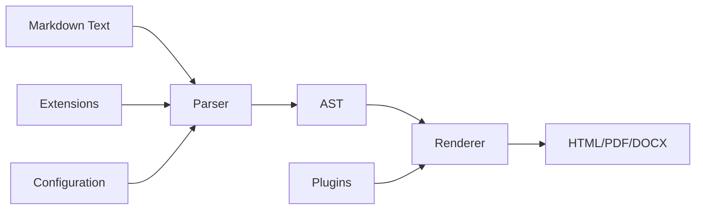

# Markdown Introduction

Markdown is a lightweight markup language that allows you to write using an easy-to-read, easy-to-write plain text format, which then converts to structurally valid HTML (and many other formats). Created by John Gruber in 2004, Markdown has become one of the most popular markup languages for writing on the web.

## What is Markdown?

Markdown is a **plain text formatting syntax** that enables you to add formatting elements to plain text documents. Unlike complex markup languages like HTML or XML, Markdown uses simple punctuation characters to create structured documents.

### Key Characteristics:

- **Human-readable**: Markdown files are easy to read in their raw form
- **Platform-independent**: Works across different operating systems and applications
- **Convertible**: Can be converted to HTML, PDF, Word documents, and other formats
- **Version control friendly**: Plain text files work well with Git and other version control systems
- **Fast to write**: Minimal syntax means faster writing and editing

### Basic Syntax Examples:

```markdown
# Heading 1
## Heading 2
### Heading 3

**Bold text** and *italic text*

- Unordered list item
- Another item

1. Ordered list item
2. Another item

[Link text](https://www.markdownlang.com)

`Inline code` and code blocks:

```javascript
function hello() {
  console.log("Hello, World!");
}
```
```

## Why use Markdown?

### 1. **Simplicity and Speed**
- Write faster with minimal syntax
- No need to remember complex HTML tags
- Focus on content, not formatting

### 2. **Universal Compatibility**
- Works everywhere: GitHub, GitLab, Reddit, Stack Overflow
- Supported by most modern text editors and IDEs
- Can be converted to any format you need

### 3. **Version Control Integration**
- Plain text files work perfectly with Git
- Easy to track changes and collaborate
- No binary file conflicts

### 4. **Future-Proof**
- Plain text never becomes obsolete
- No proprietary format dependencies
- Easy to migrate between platforms

### 5. **Learning Curve**
- Quick to learn (can master basics in 30 minutes)
- Consistent syntax across platforms
- No complex software requirements

## What's Markdown Good For?

### 📝 **Documentation**
- **Technical documentation**: API docs, user guides, README files
- **Software documentation**: Code comments, project documentation
- **Knowledge bases**: Wikis, help systems, internal docs

### ✍️ **Content Creation**
- **Blog posts**: Personal blogs, company blogs, technical articles
- **Academic writing**: Research papers, essays, reports
- **Books and ebooks**: Technical books, novels, educational content

### 💼 **Business Applications**
- **Project management**: Task lists, project notes, meeting minutes
- **Email**: Rich text emails without HTML complexity
- **Presentations**: Convert to slideshow formats
- **Reports**: Business reports, status updates, summaries

### 🌐 **Web Development**
- **Static site generators**: Jekyll, Hugo, Gatsby, VitePress
- **CMS content**: WordPress, Ghost, Contentful
- **Documentation sites**: GitBook, Docusaurus, MkDocs

### 📚 **Education**
- **Course materials**: Lecture notes, assignments, syllabi
- **Student work**: Essays, research papers, lab reports
- **Collaborative learning**: Study groups, peer reviews

### 🔧 **Technical Writing**
- **Code documentation**: Inline comments, README files
- **API documentation**: Endpoint descriptions, examples
- **Tutorials**: Step-by-step guides, how-to articles

## How to Use Markdown

### 1. **Choose Your Editor**

**Online Editors:**
- [Markdown Live Preview](hhttps://www.markdownlang.com/editor/)
- [HTML To Markdown](https://www.markdownlang.com/html-to-markdown/)
- [Markdown To HTML](https://www.markdownlang.com/markdown-to-html/)
- [URL To Markdown](https://www.markdownlang.com/url-to-markdown/)

**Desktop Applications:**
- **Typora**: WYSIWYG Markdown editor
- **Mark Text**: Real-time preview editor
- **Obsidian**: Note-taking with Markdown support
- **Notion**: All-in-one workspace with Markdown

**Code Editors:**
- **VS Code**: With Markdown extensions
- **Sublime Text**: With Markdown packages
- **Atom**: Built-in Markdown preview
- **Vim/Neovim**: With Markdown plugins

### 2. **Learn the Syntax**

#### Headers
```markdown
# H1 Header
## H2 Header
### H3 Header
#### H4 Header
##### H5 Header
###### H6 Header
```

#### Text Formatting
```markdown
**Bold text**
*Italic text*
***Bold and italic***
~~Strikethrough~~
`Inline code`
```

#### Lists
```markdown
- Unordered list item
- Another item
  - Nested item
  - Another nested item

1. Ordered list item
2. Another item
   1. Nested ordered item
   2. Another nested item
```

#### Links and Images
```markdown
[Markdown Lang](https://https://www.markdownlang.com/)
[Markdown Lang with title](https://www.markdownlang.com/ "Markdown Lang")


```

#### Code Blocks
````markdown
```javascript
function hello() {
  console.log("Hello, World!");
}
```

```python
def hello():
    print("Hello, World!")
```
````

#### Tables
```markdown
| Column 1 | Column 2 | Column 3 |
|----------|----------|----------|
| Row 1    | Data 1   | Data 2   |
| Row 2    | Data 3   | Data 4   |
```

#### Blockquotes
```markdown
> This is a blockquote
> 
> It can span multiple lines
> 
> > And can be nested
```

### 3. **Practice and Experiment**
- Start with simple documents
- Use online editors to see real-time preview
- Practice with different syntax elements
- Try converting to different formats

## How Does it Work?

### 1. **Parsing Process**

Markdown works through a **two-step process**:

1. **Parsing**: A Markdown parser reads the plain text and identifies formatting syntax
2. **Rendering**: The parser converts the syntax into HTML (or other target format)

### 2. **Parser Components**

#### **Lexer (Tokenization)**
- Breaks down the text into tokens
- Identifies different syntax elements
- Handles special characters and escape sequences

#### **Parser (AST Generation)**
- Creates an Abstract Syntax Tree (AST)
- Represents the document structure
- Handles nesting and relationships between elements

#### **Renderer (Output Generation)**
- Converts AST to target format (HTML, PDF, etc.)
- Applies styling and formatting rules
- Handles edge cases and special formatting

### 3. **Common Parsers**

#### **JavaScript**
- **marked**: Fast, lightweight parser
- **markdown-it**: Pluggable parser with extensions
- **remark**: Part of the unified ecosystem

#### **Python**
- **markdown**: Full-featured Python implementation
- **mistune**: Fast and lightweight
- **marko**: Extensible and fast

#### **Other Languages**
- **PHP**: Parsedown, CommonMark
- **Ruby**: Redcarpet, Kramdown
- **Go**: goldmark, blackfriday

### 4. **Extension Systems**

Most Markdown parsers support extensions:

#### **GitHub Flavored Markdown (GFM)**
- Tables
- Strikethrough
- Task lists
- Autolinks
- Fenced code blocks

#### **CommonMark**
- Standardized specification
- Better compatibility across parsers
- More predictable behavior

#### **Custom Extensions**
- Math equations (KaTeX, MathJax)
- Diagrams (Mermaid, PlantUML)
- Footnotes
- Definition lists
- Tables of contents

### 5. **Conversion Workflow**



### 6. **Real-World Example**

When you write:
```markdown
# Hello World

This is **bold** and *italic* text.

- Item 1
- Item 2
```

The parser converts it to:
```html
<h1>Hello World</h1>
<p>This is <strong>bold</strong> and <em>italic</em> text.</p>
<ul>
<li>Item 1</li>
<li>Item 2</li>
</ul>
```

## Getting Started

Ready to start using Markdown? Here are some next steps:

1. **Choose an editor** that fits your workflow
2. **Practice the basic syntax** with simple documents
3. **Explore extensions** like GFM for advanced features
4. **Try different parsers** to find what works best for your needs
5. **Integrate with your workflow** - use it for documentation, blogging, or note-taking

Markdown's simplicity and power make it an excellent choice for anyone who writes regularly, whether for technical documentation, creative writing, or everyday note-taking. Start with the basics, practice regularly, and you'll soon find Markdown becoming an essential part of your writing toolkit.