# 流程图

Markdown 支持通过 Mermaid 语法创建各种类型的图表和流程图，为文档提供可视化表达能力。

## Mermaid 简介

Mermaid 是一个基于文本的图表生成工具，支持多种图表类型：

- 流程图 (Flowchart)
- 序列图 (Sequence Diagram)
- 甘特图 (Gantt Chart)
- 类图 (Class Diagram)
- 状态图 (State Diagram)
- 饼图 (Pie Chart)
- 用户旅程图 (User Journey)
- Git图 (Git Graph)

## 基本语法

### 流程图 (Flowchart)

```markdown
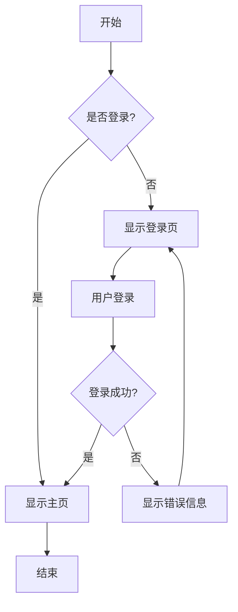
```

**渲染效果**：


### 序列图 (Sequence Diagram)

```markdown
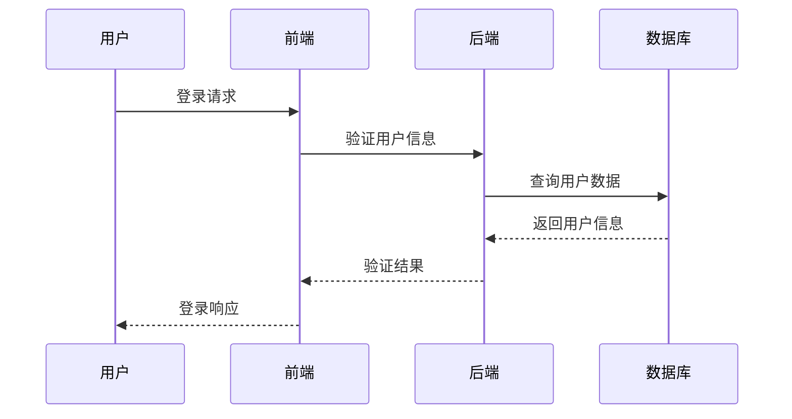
```

**渲染效果**：


## 流程图详解

### 节点类型

```markdown
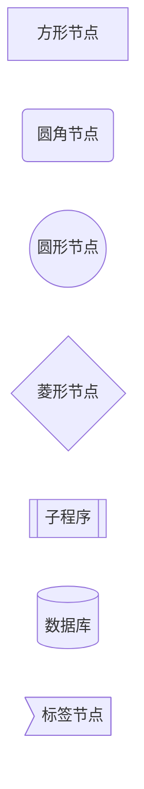
```

**渲染效果**：


### 连接线类型

```markdown
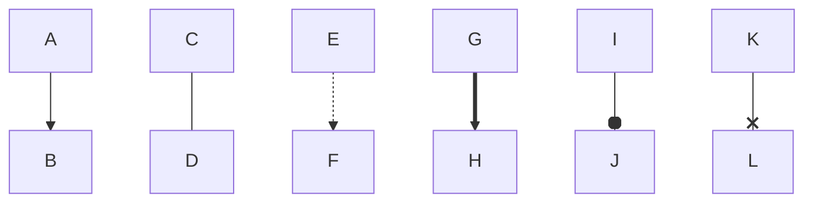
```

**渲染效果**：


### 方向控制

```markdown
<!-- 从上到下 -->
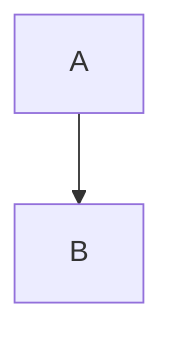

<!-- 从下到上 -->
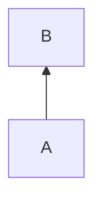

<!-- 从左到右 -->
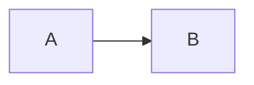

<!-- 从右到左 -->
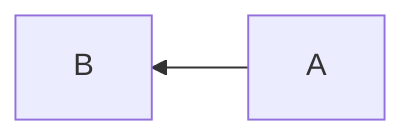
```

### 复杂流程图示例

```markdown
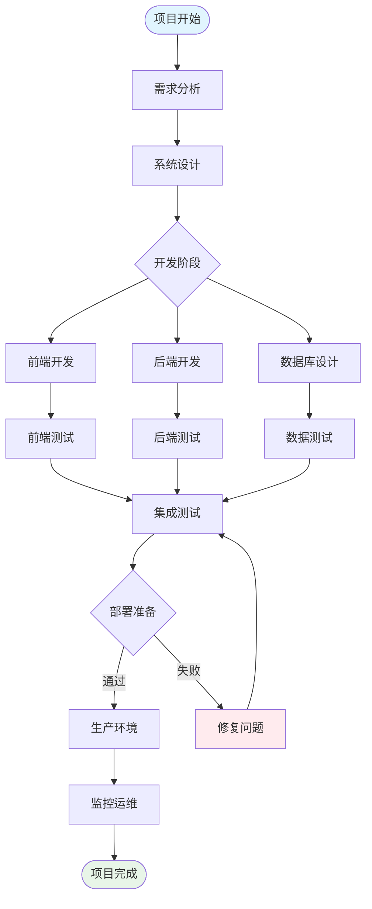
```

**渲染效果**：


## 序列图详解

### 基本语法

```markdown
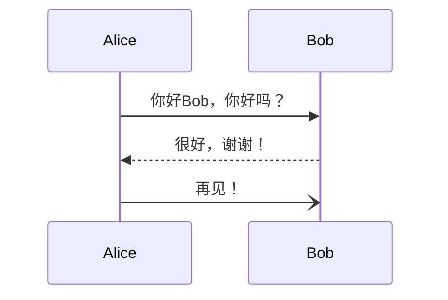
```

**渲染效果**：


### 激活框和生命线

```markdown
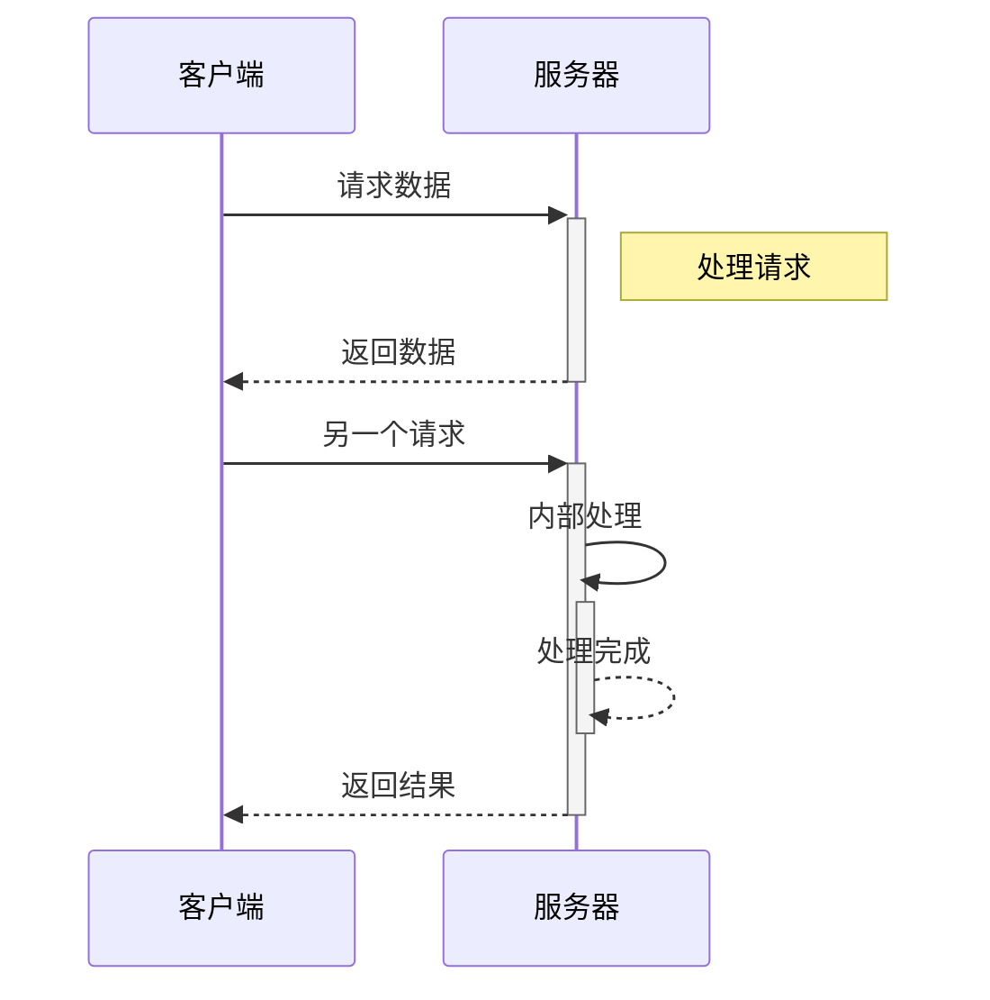
```

**渲染效果**：


### 循环和条件

```markdown
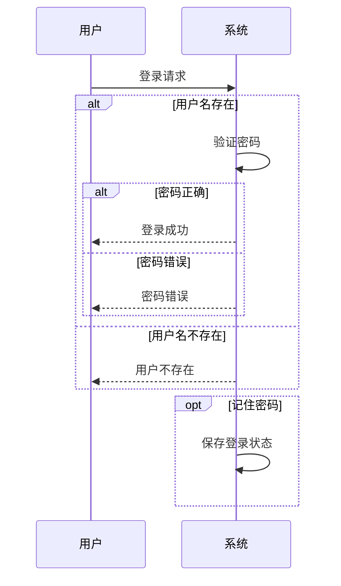
```

**渲染效果**：


## 类图 (Class Diagram)

```markdown
```mermaid
classDiagram
    class Animal {
        +String name
        +int age
        +eat()
        +sleep()
    }
    
    class Dog {
        +String breed
        +bark()
        +wagTail()
    }
    
    class Cat {
        +String color
        +meow()
        +purr()
    }
    
    Animal <|-- Dog
    Animal <|-- Cat
    
    class Owner {
        +String name
        +feedPet()
    }
    
    Owner --> Animal : owns
```
```

**渲染效果**：

```mermaid
classDiagram
    class Animal {
        +String name
        +int age
        +eat()
        +sleep()
    }
    
    class Dog {
        +String breed
        +bark()
        +wagTail()
    }
    
    class Cat {
        +String color
        +meow()
        +purr()
    }
    
    Animal <|-- Dog
    Animal <|-- Cat
    
    class Owner {
        +String name
        +feedPet()
    }
    
    Owner --> Animal : owns
```

## 状态图 (State Diagram)

```markdown
```mermaid
stateDiagram-v2
    [*] --> 空闲
    空闲 --> 运行 : 开始
    运行 --> 暂停 : 暂停
    运行 --> 完成 : 结束
    暂停 --> 运行 : 继续
    暂停 --> 停止 : 停止
    停止 --> 空闲 : 重置
    完成 --> 空闲 : 重置
    完成 --> [*]
    
    state 运行 {
        [*] --> 初始化
        初始化 --> 处理中
        处理中 --> 验证
        验证 --> [*]
    }
```
```

**渲染效果**：

```mermaid
stateDiagram-v2
    [*] --> 空闲
    空闲 --> 运行 : 开始
    运行 --> 暂停 : 暂停
    运行 --> 完成 : 结束
    暂停 --> 运行 : 继续
    暂停 --> 停止 : 停止
    停止 --> 空闲 : 重置
    完成 --> 空闲 : 重置
    完成 --> [*]
    
    state 运行 {
        [*] --> 初始化
        初始化 --> 处理中
        处理中 --> 验证
        验证 --> [*]
    }
```

## 甘特图 (Gantt Chart)

```markdown
```mermaid
gantt
    title 项目开发时间线
    dateFormat  YYYY-MM-DD
    section 需求分析
    需求收集          :done,    des1, 2024-01-01,2024-01-05
    需求分析          :done,    des2, after des1, 5d
    需求评审          :done,    des3, after des2, 2d
    
    section 设计阶段
    系统设计          :active,  design1, 2024-01-12, 7d
    UI设计           :         design2, after design1, 5d
    数据库设计        :         design3, after design1, 3d
    
    section 开发阶段
    前端开发          :         dev1, after design2, 10d
    后端开发          :         dev2, after design3, 12d
    测试              :         test1, after dev1, 5d
```
```

**渲染效果**：

```mermaid
gantt
    title 项目开发时间线
    dateFormat  YYYY-MM-DD
    section 需求分析
    需求收集          :done,    des1, 2024-01-01,2024-01-05
    需求分析          :done,    des2, after des1, 5d
    需求评审          :done,    des3, after des2, 2d
    
    section 设计阶段
    系统设计          :active,  design1, 2024-01-12, 7d
    UI设计           :         design2, after design1, 5d
    数据库设计        :         design3, after design1, 3d
    
    section 开发阶段
    前端开发          :         dev1, after design2, 10d
    后端开发          :         dev2, after design3, 12d
    测试              :         test1, after dev1, 5d
```

## 饼图 (Pie Chart)

```markdown
```mermaid
pie title 网站访问来源
    "搜索引擎" : 45
    "社交媒体" : 25
    "直接访问" : 20
    "邮件营销" : 7
    "其他" : 3
```
```

**渲染效果**：

```mermaid
pie title 网站访问来源
    "搜索引擎" : 45
    "社交媒体" : 25
    "直接访问" : 20
    "邮件营销" : 7
    "其他" : 3
```

## 用户旅程图 (User Journey)

```markdown
```mermaid
journey
    title 用户购物旅程
    section 发现
      访问主页: 3: 用户
      浏览商品: 4: 用户
      搜索产品: 4: 用户
    section 考虑
      查看详情: 4: 用户
      比较价格: 3: 用户
      阅读评价: 5: 用户
    section 购买
      加入购物车: 4: 用户
      结算: 3: 用户
      支付: 2: 用户
    section 使用
      收到商品: 5: 用户
      使用产品: 4: 用户
      写评价: 4: 用户
```
```

**渲染效果**：

```mermaid
journey
    title 用户购物旅程
    section 发现
      访问主页: 3: 用户
      浏览商品: 4: 用户
      搜索产品: 4: 用户
    section 考虑
      查看详情: 4: 用户
      比较价格: 3: 用户
      阅读评价: 5: 用户
    section 购买
      加入购物车: 4: 用户
      结算: 3: 用户
      支付: 2: 用户
    section 使用
      收到商品: 5: 用户
      使用产品: 4: 用户
      写评价: 4: 用户
```

## Git 图 (Git Graph)

```markdown
```mermaid
gitgraph
    commit id: "初始提交"
    commit id: "添加用户模块"
    branch feature/auth
    commit id: "添加登录功能"
    commit id: "添加注册功能"
    checkout main
    commit id: "修复主页bug"
    merge feature/auth
    commit id: "版本v1.0"
    branch hotfix
    commit id: "紧急修复"
    checkout main
    merge hotfix
    commit id: "版本v1.0.1"
```
```

**渲染效果**：

```mermaid
gitgraph
    commit id: "初始提交"
    commit id: "添加用户模块"
    branch feature/auth
    commit id: "添加登录功能"
    commit id: "添加注册功能"
    checkout main
    commit id: "修复主页bug"
    merge feature/auth
    commit id: "版本v1.0"
    branch hotfix
    commit id: "紧急修复"
    checkout main
    merge hotfix
    commit id: "版本v1.0.1"
```

## 实际应用场景

### 系统架构图

```markdown
```mermaid
flowchart TB
    subgraph "用户层"
        Web[Web浏览器]
        Mobile[移动应用]
        API[API客户端]
    end
    
    subgraph "网关层"
        Gateway[API网关]
        Auth[认证服务]
    end
    
    subgraph "服务层"
        UserService[用户服务]
        OrderService[订单服务]
        PaymentService[支付服务]
        NotificationService[通知服务]
    end
    
    subgraph "数据层"
        UserDB[(用户数据库)]
        OrderDB[(订单数据库)]
        Cache[(Redis缓存)]
        Queue[消息队列]
    end
    
    Web --> Gateway
    Mobile --> Gateway
    API --> Gateway
    
    Gateway --> Auth
    Gateway --> UserService
    Gateway --> OrderService
    Gateway --> PaymentService
    
    UserService --> UserDB
    OrderService --> OrderDB
    PaymentService --> Queue
    NotificationService --> Queue
    
    UserService --> Cache
    OrderService --> Cache
    
    style Gateway fill:#e1f5fe
    style Auth fill:#fff3e0
    style Cache fill:#f3e5f5
```
```

### API 调用流程

```markdown
```mermaid
sequenceDiagram
    participant C as 客户端
    participant G as API网关
    participant A as 认证服务
    participant U as 用户服务
    participant D as 数据库
    participant R as Redis
    
    C->>G: 请求用户信息
    G->>A: 验证Token
    A->>R: 检查Token缓存
    R-->>A: Token有效
    A-->>G: 认证成功
    
    G->>U: 获取用户信息
    U->>R: 检查用户缓存
    alt 缓存存在
        R-->>U: 返回用户数据
    else 缓存不存在
        U->>D: 查询数据库
        D-->>U: 返回用户信息
        U->>R: 更新缓存
    end
    
    U-->>G: 返回用户信息
    G-->>C: 响应用户数据
```
```

### 业务流程图

```markdown
```mermaid
flowchart TD
    Start([用户下单]) --> Check{检查库存}
    Check -->|有库存| Reserve[预留库存]
    Check -->|无库存| OutOfStock[库存不足]
    OutOfStock --> Notify[通知用户]
    Notify --> End1([结束])
    
    Reserve --> Payment{支付处理}
    Payment -->|成功| ConfirmOrder[确认订单]
    Payment -->|失败| ReleaseStock[释放库存]
    ReleaseStock --> PaymentFailed[支付失败]
    PaymentFailed --> End2([结束])
    
    ConfirmOrder --> UpdateInventory[更新库存]
    UpdateInventory --> SendNotification[发送通知]
    SendNotification --> Logistics[安排物流]
    Logistics --> End3([订单完成])
    
    style Start fill:#e8f5e8
    style End1 fill:#ffebee
    style End2 fill:#ffebee
    style End3 fill:#e8f5e8
    style OutOfStock fill:#ffebee
    style PaymentFailed fill:#ffebee
```
```

## 样式和主题

### 节点样式

```markdown
```mermaid
flowchart LR
    A[默认样式] --> B[样式1]
    A --> C[样式2]
    A --> D[样式3]
    
    style B fill:#f9f,stroke:#333,stroke-width:4px
    style C fill:#bbf,stroke:#f66,stroke-width:2px,color:#fff,stroke-dasharray: 5 5
    style D fill:#f96,stroke:#333,stroke-width:4px,color:#fff
```
```

### 类样式

```markdown
```mermaid
flowchart LR
    A[节点A]:::classA --> B[节点B]:::classB
    A --> C[节点C]:::classC
    
    classDef classA fill:#e1f5fe,stroke:#01579b,stroke-width:2px
    classDef classB fill:#f3e5f5,stroke:#4a148c,stroke-width:2px
    classDef classC fill:#e8f5e8,stroke:#1b5e20,stroke-width:2px
```
```

## 配置和兼容性

### VitePress 配置

```javascript
// .vitepress/config.js
export default {
  markdown: {
    mermaid: true
  }
}
```

### GitHub 支持

GitHub 原生支持 Mermaid，可以直接在 Markdown 文件中使用：

```markdown
```mermaid
graph LR
    A --> B
```
```

### 其他平台支持

| 平台 | 支持状态 | 配置要求 |
|------|----------|----------|
| **GitHub** | ✅ 原生支持 | 无需配置 |
| **GitLab** | ✅ 原生支持 | 无需配置 |
| **VitePress** | ✅ 插件支持 | 需要配置 |
| **Jekyll** | ✅ 插件支持 | 安装插件 |
| **Hugo** | ✅ 主题支持 | 依赖主题 |

## 最佳实践

### 设计建议

```markdown
✅ 推荐做法：

1. **保持简洁**：
   - 避免过于复杂的图表
   - 使用清晰的标签和连接

2. **合理布局**：
   - 选择合适的图表方向
   - 保持逻辑流向清晰

3. **统一样式**：
   - 使用一致的颜色主题
   - 保持图表风格统一

4. **添加说明**：
   - 为复杂图表添加标题
   - 提供必要的文字说明

❌ 避免做法：

1. 图表过于复杂难以理解
2. 连接线交叉过多
3. 标签模糊不清
4. 缺少必要的图例
```

### 性能考虑

```markdown
- **大型图表优化**：
  - 考虑拆分复杂图表
  - 使用子图组织结构

- **加载性能**：
  - 避免在单页面使用过多图表
  - 考虑懒加载实现

- **移动端适配**：
  - 确保图表在小屏幕上可读
  - 考虑横向滚动设计
```

## 相关语法

- [嵌入HTML](/zh/advanced/html) - HTML增强功能
- [数学公式](/zh/advanced/math) - LaTeX数学表达式
- [最佳实践](/zh/advanced/best-practices) - 文档编写建议

## 工具和资源

### 在线编辑器

- **Mermaid Live Editor**: 官方在线编辑器
- **Draw.io**: 通用图表绘制工具
- **Lucidchart**: 专业图表制作平台
- **Excalidraw**: 手绘风格图表工具

### 开发工具

- **Mermaid CLI**: 命令行工具
- **VS Code Mermaid**: Visual Studio Code 插件
- **Atom Mermaid**: Atom 编辑器插件
- **IntelliJ Mermaid**: JetBrains IDE 插件

### 参考资源

- **Mermaid 官方文档**: 完整语法参考
- **Mermaid 示例库**: 各种图表示例
- **GitHub Mermaid**: 在 GitHub 中使用
- **Awesome Mermaid**: 相关资源收集

通过掌握流程图语法，您可以在文档中创建专业的可视化图表，提升内容的表达效果和理解度。 