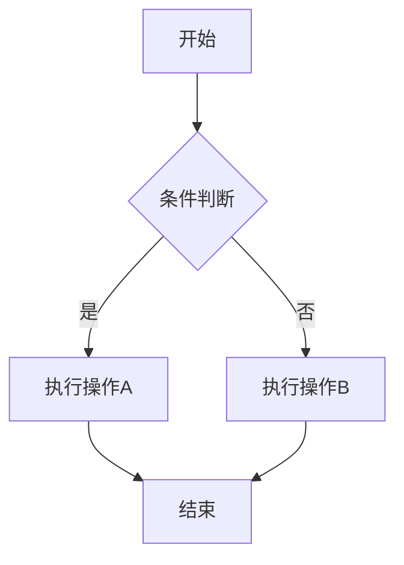
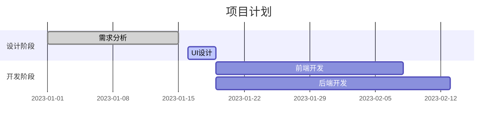

# Markdown 高级用法

当 Markdown 的基本语法和扩展语法无法满足特定需求时，你需要掌握一些高级技巧和变通方法。本章节将介绍如何突破 Markdown 的限制，实现更复杂的格式和功能。

## 什么是高级用法？

高级用法（也称为变通方法）是指在 Markdown 语法限制下，通过创造性的方法实现特定的格式化效果。这些技巧通常涉及：

- 嵌入 HTML 代码
- 组合使用不同语法元素  
- 利用特定平台的扩展功能
- 使用第三方工具和插件

## 主要应用场景

### 布局控制
- 文本对齐
- 多列布局
- 图文混排
- 间距调整

### 样式定制
- 颜色设置
- 字体修改
- 尺寸控制
- 特殊效果

### 高级内容
- 数学公式
- 流程图和图表
- 交互元素
- 嵌入媒体

## HTML 增强

### 基本 HTML 标签

Markdown 支持在文档中直接使用 HTML 标签：

```html
<div style="text-align: center;">
  <strong style="color: red;">居中的红色粗体文本</strong>
</div>


<table border="1">
  <tr>
    <td style="background-color: #f0f0f0;">自定义样式的表格</td>
  </tr>
</table>
```

### 样式控制

使用 CSS 样式实现精确控制：

```html
<p style="color: blue; font-size: 18px; text-align: center;">
  蓝色、18像素、居中的段落
</p>

<div style="border: 2px solid #333; padding: 10px; border-radius: 5px;">
  带边框的内容区域
</div>
```

## 图片高级处理

### 图片对齐

```html
<!-- 左对齐 -->


<!-- 右对齐 -->


<!-- 居中对齐 -->
<div align="center">
  
</div>
```

### 图片尺寸控制

```html
<!-- 固定宽高 -->


<!-- 响应式图片 -->


<!-- 图片加边框 -->

```

### 图文混排

```html
<div style="display: flex; align-items: center;">
  
  <div>
    <h3 style="margin: 0;">用户名</h3>
    <p style="margin: 5px 0;">这里是用户的介绍文本...</p>
  </div>
</div>
```

## 表格增强

### 表格样式定制

```html
<table style="border-collapse: collapse; width: 100%;">
  <thead style="background-color: #f2f2f2;">
    <tr>
      <th style="border: 1px solid #ddd; padding: 8px;">列标题1</th>
      <th style="border: 1px solid #ddd; padding: 8px;">列标题2</th>
    </tr>
  </thead>
  <tbody>
    <tr style="background-color: #f9f9f9;">
      <td style="border: 1px solid #ddd; padding: 8px;">数据1</td>
      <td style="border: 1px solid #ddd; padding: 8px;">数据2</td>
    </tr>
  </tbody>
</table>
```

### 复杂表格结构

```html
<table>
  <tr>
    <td rowspan="2">合并行</td>
    <td>普通单元格</td>
  </tr>
  <tr>
    <td>普通单元格</td>
  </tr>
  <tr>
    <td colspan="2">合并列</td>
  </tr>
</table>
```

## 数学公式支持

### LaTeX 语法

许多平台支持 LaTeX 数学公式：

```latex
行内公式：$E = mc^2$

块级公式：
$$
\int_{-\infty}^{\infty} e^{-x^2} dx = \sqrt{\pi}
$$

矩阵：
$$
\begin{pmatrix}
a & b \\
c & d
\end{pmatrix}
$$
```

### MathJax 集成

```html
<script src="https://polyfill.io/v3/polyfill.min.js?features=es6"></script>
<script id="MathJax-script" async src="https://cdn.jsdelivr.net/npm/mathjax@3/es5/tex-mml-chtml.js"></script>
```

## 流程图和图表

### Mermaid 图表



### 甘特图



## 交互元素

### 折叠内容

```html
<details>
  <summary>点击展开</summary>
  <p>这里是折叠的内容...</p>
</details>
```

### 进度条

```html
<progress value="70" max="100">70%</progress>
```

### 按钮样式

```html
<button style="background-color: #4CAF50; color: white; padding: 10px 20px; border: none; border-radius: 4px;">
  点击按钮
</button>
```

## 布局技巧

### 多列布局

```html
<div style="display: grid; grid-template-columns: 1fr 1fr; gap: 20px;">
  <div>
    <h3>左列内容</h3>
    <p>这里是左列的内容...</p>
  </div>
  <div>
    <h3>右列内容</h3>
    <p>这里是右列的内容...</p>
  </div>
</div>
```

### 卡片布局

```html
<div style="border: 1px solid #ddd; border-radius: 8px; padding: 16px; margin: 16px 0; box-shadow: 0 2px 4px rgba(0,0,0,0.1);">
  <h3 style="margin-top: 0;">卡片标题</h3>
  <p>卡片内容描述...</p>
  <a href="#" style="color: #007bff; text-decoration: none;">了解更多</a>
</div>
```

## 平台特定功能

### GitHub 特性

```markdown
<!-- 任务列表 -->
- [x] 完成的任务
- [ ] 未完成的任务

<!-- 提及用户 -->
@username

<!-- 引用问题 -->
#123

<!-- 代码差异 -->
```diff
- 删除的行
+ 添加的行
```
```

### GitLab 功能

```markdown
<!-- 视频嵌入 -->


<!-- 音频嵌入 -->

```

## 最佳实践建议

### 兼容性考虑
- 在不同平台测试你的高级语法
- 为不支持的平台提供降级方案
- 优先使用标准 Markdown 语法

### 性能优化
- 避免过度使用内联样式
- 使用外部 CSS 文件统一样式
- 压缩图片和媒体文件

### 可维护性
- 保持代码简洁和可读性
- 添加必要的注释说明
- 使用版本控制管理文档

## 工具和资源

### 编辑器推荐
- [Typora](https://typora.io/) - 所见即所得编辑器
- [Obsidian](https://obsidian.md/) - 知识管理工具
- [Mark Text](https://marktext.app/) - 实时预览编辑器

### 在线工具
- [Markdown Tables Generator](https://www.tablesgenerator.com/markdown_tables)
- [Mermaid Live Editor](https://mermaid.live/)
- [LaTeX 公式编辑器](https://www.latexlive.com/)

### 参考资源
- [CommonMark Spec](https://commonmark.org/)
- [GitHub Flavored Markdown](https://github.github.com/gfm/)
- [Markdown Guide](https://www.markdownguide.org/)

## 进一步学习

- [HTML 嵌入详解](/zh/advanced/html)
- [数学公式语法](/zh/advanced/math)
- [流程图制作](/zh/advanced/diagrams)
- [最佳实践指南](/zh/advanced/best-practices) 