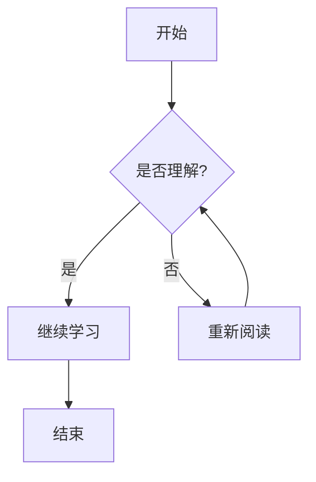

# Markdown 扩展语法

基本的 Markdown 语法提供了创建文档所需的基本元素，但对于某些特定需求来说还不够。这就是扩展语法的用武之地。

扩展语法是在基本语法基础上添加的额外功能，让你能够创建更丰富、更复杂的文档。

## 什么是扩展语法？

扩展语法是指超出原始 Markdown 规范的语法元素。这些扩展由不同的 Markdown 处理器添加，用于支持额外的功能。

### 常见的扩展语法

- **表格** - 创建数据表格
- **围栏代码块** - 带语法高亮的代码块
- **脚注** - 添加脚注引用
- **标题 ID** - 为标题添加自定义 ID
- **定义列表** - 术语和定义的列表
- **删除线** - 划掉文本
- **任务列表** - 带复选框的清单
- **emoji** - 表情符号
- **高亮** - 突出显示文本
- **下标和上标** - 数学公式中常用

## 支持情况

需要注意的是，**不是所有 Markdown 应用程序都支持扩展语法**。使用前需要确认你的 Markdown 处理器是否支持你想使用的扩展语法。

### 主流支持

以下平台和工具较好地支持扩展语法：

- **GitHub Flavored Markdown (GFM)** - GitHub 的 Markdown 扩展
- **GitLab Flavored Markdown** - GitLab 的扩展
- **Typora** - 富文本 Markdown 编辑器
- **Obsidian** - 知识管理工具
- **VitePress** - 静态站点生成器
- **Hugo** - 静态站点生成器

## 表格

创建表格是最常用的扩展语法之一：

```markdown
| 姓名 | 年龄 | 职业 |
|------|------|------|
| 张三 | 25   | 工程师 |
| 李四 | 30   | 设计师 |
```

| 姓名 | 年龄 | 职业 |
|------|------|------|
| 张三 | 25   | 工程师 |
| 李四 | 30   | 设计师 |

## 围栏代码块

带语法高亮的代码块：

````markdown
```javascript
function hello() {
    console.log("Hello, World!");
}
```
````

```javascript
function hello() {
    console.log("Hello, World!");
}
```

## 任务列表

创建待办事项清单：

```markdown
- [x] 完成项目计划
- [ ] 编写代码
- [ ] 测试功能
- [ ] 部署上线
```

- [x] 完成项目计划
- [ ] 编写代码
- [ ] 测试功能
- [ ] 部署上线

## 删除线

表示已删除或不正确的内容：

```markdown
~~这段文字有删除线~~
```

~~这段文字有删除线~~

## 自动链接

自动识别 URL 和邮箱地址：

```markdown
访问 https://markdown.com.cn 了解更多信息。
联系邮箱：example@domain.com
```

访问 https://markdown.com.cn 了解更多信息。
联系邮箱：example@domain.com

## 脚注

为文档添加注释和参考：

```markdown
这里有一个脚注的例子[^1]。

[^1]: 这是脚注的内容。
```

这里有一个脚注的例子[^1]。

[^1]: 这是脚注的内容。

## 定义列表

创建术语和定义的列表：

```markdown
Markdown
:   一种轻量级标记语言

HTML
:   超文本标记语言
:   用于创建网页的标准标记语言
```

## 数学公式

支持 LaTeX 风格的数学公式：

```markdown
行内公式：$E = mc^2$

块级公式：
$$
\sum_{i=1}^n a_i = 0
$$
```

## 图表和流程图

一些高级编辑器支持 Mermaid 图表：

````markdown

````

## 扩展语法学习路径

建议按以下顺序学习扩展语法：

1. **[表格](/zh/extended/tables)** - 最常用和实用
2. **[围栏代码块](/zh/extended/fenced-code-blocks)** - 程序员必备
3. **[任务列表](/zh/extended/task-lists)** - 项目管理利器
4. **[删除线](/zh/extended/strikethrough)** - 简单易用
5. **[脚注](/zh/extended/footnotes)** - 学术写作需要
6. **[定义列表](/zh/extended/definition-lists)** - 术语解释
7. **[标题 ID](/zh/extended/heading-ids)** - 高级链接
8. **[高亮](/zh/extended/highlight)** - 强调重点

## 兼容性注意事项

在使用扩展语法时：

- **测试兼容性** - 在目标平台上测试你的 Markdown
- **提供备用方案** - 考虑在不支持扩展语法的平台上的显示效果
- **文档说明** - 在文档中说明使用了哪些扩展语法
- **标准化选择** - 团队内统一使用的扩展语法标准

## 下一步

选择你感兴趣的扩展语法开始学习：

- [表格语法详解](/zh/extended/tables)
- [代码块语法](/zh/extended/fenced-code-blocks)  
- [查看完整扩展语法列表](/zh/extended/) 