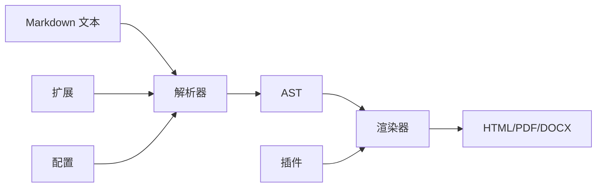

# Markdown 介绍

Markdown 是一种轻量级标记语言，允许你使用易于阅读、易于编写的纯文本格式进行写作，然后可以转换为结构有效的 HTML（以及许多其他格式）。由 John Gruber 在 2004 年创建，Markdown 已成为网络上最受欢迎的标记语言之一。

## 什么是 Markdown？

Markdown 是一种**纯文本格式化语法**，使你能够向纯文本文档添加格式化元素。与 HTML 或 XML 等复杂的标记语言不同，Markdown 使用简单的标点符号来创建结构化文档。

### 主要特性：

- **人类可读**：Markdown 文件在原始形式下易于阅读
- **平台无关**：可在不同的操作系统和应用程序中工作
- **可转换**：可以转换为 HTML、PDF、Word 文档和其他格式
- **版本控制友好**：纯文本文件与 Git 和其他版本控制系统配合良好
- **快速编写**：最少的语法意味着更快的编写和编辑

### 基础语法示例：

```markdown
# 标题 1
## 标题 2
### 标题 3

**粗体文本** 和 *斜体文本*

- 无序列表项
- 另一个项目

1. 有序列表项
2. 另一个项目

[链接文本](https://www.markdownlang.com)

`内联代码` 和代码块：

```javascript
function hello() {
  console.log("Hello, World!");
}
```
```

## 为什么使用 Markdown？

### 1. **简单和速度**
- 使用最少的语法更快地编写
- 无需记住复杂的 HTML 标签
- 专注于内容，而不是格式化

### 2. **通用兼容性**
- 无处不在：GitHub、GitLab、Reddit、Stack Overflow
- 大多数现代文本编辑器和 IDE 都支持
- 可以转换为任何你需要的格式

### 3. **版本控制集成**
- 纯文本文件与 Git 完美配合
- 易于跟踪更改和协作
- 没有二进制文件冲突

### 4. **面向未来**
- 纯文本永远不会过时
- 没有专有格式依赖
- 易于在平台之间迁移

### 5. **学习曲线**
- 快速学习（可以在 30 分钟内掌握基础知识）
- 跨平台一致的语法
- 没有复杂的软件要求

## Markdown 适合什么？

### 📝 **文档编写**
- **技术文档**：API 文档、用户指南、README 文件
- **软件文档**：代码注释、项目文档
- **知识库**：维基、帮助系统、内部文档

### ✍️ **内容创作**
- **博客文章**：个人博客、公司博客、技术文章
- **学术写作**：研究论文、论文、报告
- **书籍和电子书**：技术书籍、小说、教育内容

### 💼 **商业应用**
- **项目管理**：任务列表、项目笔记、会议记录
- **电子邮件**：富文本电子邮件，无需 HTML 复杂性
- **演示文稿**：转换为幻灯片格式
- **报告**：商业报告、状态更新、摘要

### 🌐 **网站开发**
- **静态网站生成器**：Jekyll、Hugo、Gatsby、VitePress
- **CMS 内容**：WordPress、Ghost、Contentful
- **文档网站**：GitBook、Docusaurus、MkDocs

### 📚 **教育**
- **课程材料**：讲义、作业、教学大纲
- **学生作业**：论文、研究论文、实验报告
- **协作学习**：学习小组、同行评议

### 🔧 **技术写作**
- **代码文档**：内联注释、README 文件
- **API 文档**：端点描述、示例
- **教程**：分步指南、操作文章

## 如何使用 Markdown

### 1. **选择你的编辑器**

**在线编辑器：**
- [Markdown 实时预览](https://www.markdownlang.com/editor/)
- [HTML 转 Markdown](https://www.markdownlang.com/html-to-markdown/)
- [Markdown 转 HTML](https://www.markdownlang.com/markdown-to-html/)
- [URL 转 Markdown](https://www.markdownlang.com/url-to-markdown/)

**桌面应用程序：**
- **Typora**：所见即所得的 Markdown 编辑器
- **Mark Text**：实时预览编辑器
- **Obsidian**：支持 Markdown 的笔记应用
- **Notion**：支持 Markdown 的一体化工作空间

**代码编辑器：**
- **VS Code**：带有 Markdown 扩展
- **Sublime Text**：带有 Markdown 包
- **Atom**：内置 Markdown 预览
- **Vim/Neovim**：带有 Markdown 插件

### 2. **学习语法**

#### 标题
```markdown
# H1 标题
## H2 标题
### H3 标题
#### H4 标题
##### H5 标题
###### H6 标题
```

#### 文本格式化
```markdown
**粗体文本**
*斜体文本*
***粗体和斜体***
~~删除线~~
`内联代码`
```

#### 列表
```markdown
- 无序列表项
- 另一个项目
  - 嵌套项目
  - 另一个嵌套项目

1. 有序列表项
2. 另一个项目
   1. 嵌套有序项目
   2. 另一个嵌套项目
```

#### 链接和图片
```markdown
[Markdown Lang](https://www.markdownlang.com/)
[带标题的 Markdown Lang](https://www.markdownlang.com/ "Markdown Lang")


```

#### 代码块
````markdown
```javascript
function hello() {
  console.log("Hello, World!");
}
```

```python
def hello():
    print("Hello, World!")
```
````

#### 表格
```markdown
| 列 1 | 列 2 | 列 3 |
|------|------|------|
| 行 1 | 数据 1 | 数据 2 |
| 行 2 | 数据 3 | 数据 4 |
```

#### 引用块
```markdown
> 这是一个引用块
> 
> 它可以跨越多行
> 
> > 并且可以嵌套
```

### 3. **练习和实验**
- 从简单文档开始
- 使用在线编辑器查看实时预览
- 练习不同的语法元素
- 尝试转换为不同格式

## 它是如何工作的？

### 1. **解析过程**

Markdown 通过**两步过程**工作：

1. **解析**：Markdown 解析器读取纯文本并识别格式化语法
2. **渲染**：解析器将语法转换为 HTML（或其他目标格式）

### 2. **解析器组件**

#### **词法分析器（标记化）**
- 将文本分解为标记
- 识别不同的语法元素
- 处理特殊字符和转义序列

#### **解析器（AST 生成）**
- 创建抽象语法树（AST）
- 表示文档结构
- 处理元素之间的嵌套和关系

#### **渲染器（输出生成）**
- 将 AST 转换为目标格式（HTML、PDF 等）
- 应用样式和格式化规则
- 处理边缘情况和特殊格式化

### 3. **常见解析器**

#### **JavaScript**
- **marked**：快速、轻量级解析器
- **markdown-it**：可插拔的解析器，支持扩展
- **remark**：统一生态系统的一部分

#### **Python**
- **markdown**：功能完整的 Python 实现
- **mistune**：快速且轻量级
- **marko**：可扩展且快速

#### **其他语言**
- **PHP**：Parsedown、CommonMark
- **Ruby**：Redcarpet、Kramdown
- **Go**：goldmark、blackfriday

### 4. **扩展系统**

大多数 Markdown 解析器支持扩展：

#### **GitHub 风格 Markdown（GFM）**
- 表格
- 删除线
- 任务列表
- 自动链接
- 围栏代码块

#### **CommonMark**
- 标准化规范
- 解析器之间更好的兼容性
- 更可预测的行为

#### **自定义扩展**
- 数学方程（KaTeX、MathJax）
- 图表（Mermaid、PlantUML）
- 脚注
- 定义列表
- 目录

### 5. **转换工作流**



### 6. **实际示例**

当你编写：
```markdown
# Hello World

这是**粗体**和*斜体*文本。

- 项目 1
- 项目 2
```

解析器将其转换为：
```html
<h1>Hello World</h1>
<p>这是 <strong>粗体</strong> 和 <em>斜体</em> 文本。</p>
<ul>
<li>项目 1</li>
<li>项目 2</li>
</ul>
```

## 开始使用

准备好开始使用 Markdown 了吗？以下是一些后续步骤：

1. **选择一个编辑器**，适合你的工作流程
2. **练习基本语法**，使用简单文档
3. **探索扩展**，如 GFM 的高级功能
4. **尝试不同的解析器**，找到最适合你需求的
5. **集成到你的工作流程中** - 用于文档编写、博客或笔记

Markdown 的简单性和强大功能使其成为任何定期写作的人的绝佳选择，无论是技术文档、创意写作还是日常笔记。从基础开始，定期练习，你很快就会发现 Markdown 成为你写作工具包的重要组成部分。